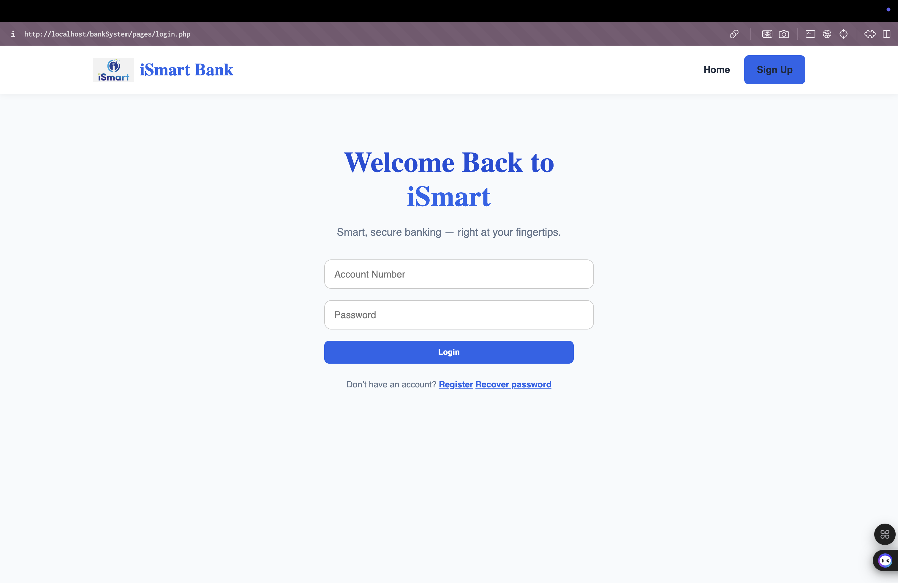
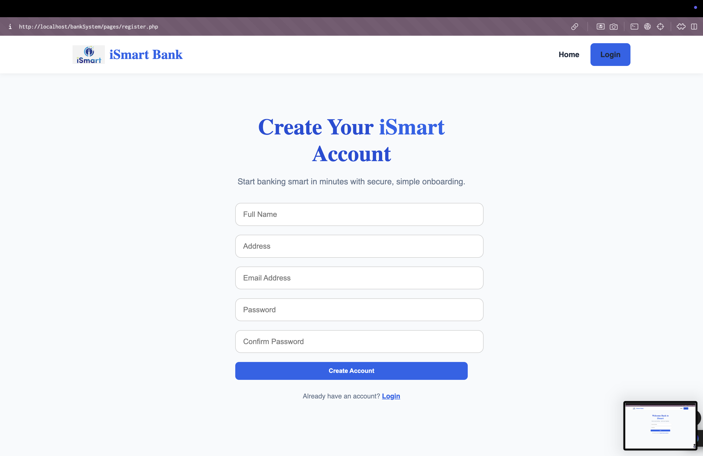
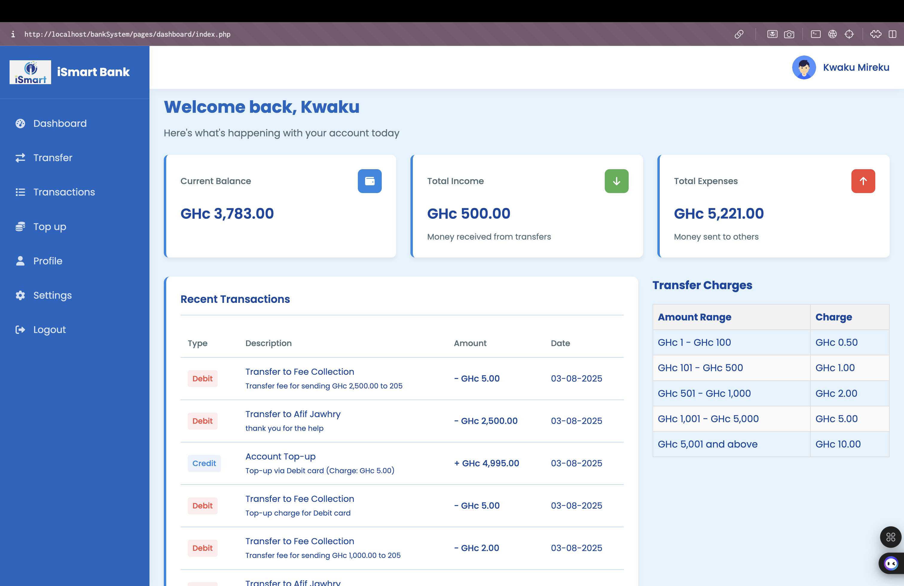
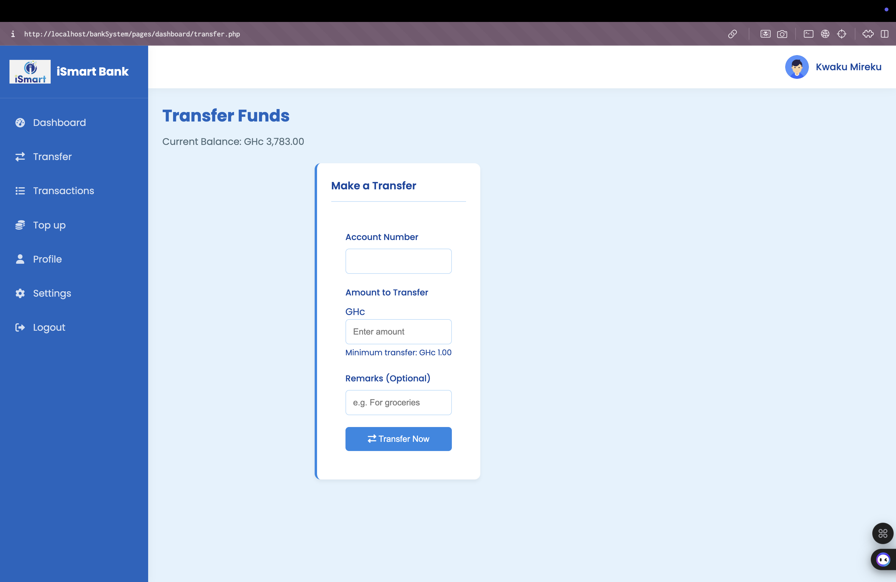

```markdown
# iSmart Bank - Digital Wallet System  

## Table of Contents  
1. [Project Overview](#project-overview)  
2. [Core Features](#core-features)  
3. [Technical Stack](#technical-stack)  
4. [Setup & Installation](#setup--installation)  
5. [Screenshots](#screenshots)  
6. [Future Improvements](#future-improvements)  
7. [Demo Video](#demo-video)  

---

## Project Overview  

**iSmart Bank** is a lightweight digital wallet system that mimics basic banking operations. Users can securely register, login, manage balances, perform peer-to-peer transfers, and review transaction history — all via a modern web interface.  

The application is built using **PHP** and **MySQL** on the backend, with **HTML/CSS/JavaScript** handling the frontend.  

---

## Core Features  

### 1. User Authentication  
- Registration with email, password, and personal details  
- Login with session-based security  
- Logout to safely end sessions  

### 2. Wallet Dashboard  
- Real-time balance overview  
- Summarized credits and debits  
- List of recent transactions  

### 3. Add Funds (Top-Up)  
- Users can simulate funding their wallets  
- Dynamic service charges based on amount  
- Charges recorded and routed to a central Fee Collection Account  

### 4. Transfer Funds  
- Send funds to other users using account number  
- Smart validations:
  - Balance check  
  - Account existence check  
  - No self-transfers  
- Fees are dynamically applied and logged  

### 5. Transaction History  
- Lists all sent and received transactions  
- Shows:
  - Transaction amount  
  - Date & Time  
  - Remarks (e.g., "Transfer to John", "Top-up Charge")  
- Clear visual tags for credit and debit  

---

## Technical Stack  

**Backend**: PHP, MySQL  
**Frontend**: HTML, CSS, JavaScript  
**Authentication**: PHP Sessions  
**Web Server**: Apache (XAMPP)  

### Database Schema  
- `balance`: Tracks current user balances  
- `credentials`: Stores account login credentials  
- `transactions`: Records all transfer and top-up operations  
- `userinfo`: Holds user profile data  

---

## Setup & Installation  

### Requirements  
- PHP  
- MySQL  
- Apache Server (e.g., XAMPP)  

### Deployment Steps  

1. **Clone Repository**  
   ```bash
   git clone [repository-url]
   cd iSmart-Bank
   ```

2. **Import Database**
   - Launch phpMyAdmin
   - Import the `bms.sql` file

3. **Update Database Config**
   Edit `/configs/db.php` with your database credentials.

4. **Run the Project**
   ```bash
   php -S localhost:8000
   ```
   Visit: [http://localhost:8000/pages/index.php](http://localhost:8000/pages/index.php)

---


### Transaction Recording

```php
$log_transaction = "INSERT INTO transactions 
                   (Sender, Receiver, Amount, Remarks, DateTime) 
                   VALUES 
                   ('$sender', '$receiver', '$amount', '$remarks', NOW())";
```

---

## Screenshots

### Home Page (1)


### Home Page (2)


### Login Page


### Signup Page


### Dashboard


### Transfer Page


### Profile Page


---

## Future Improvements

- Implement secure password reset using email OTP or token-based system
- Add interest calculator or savings goals
- Build mobile-responsive PWA version
- Add virtual account numbers for merchant use
- Introduce analytics or spending insights

---

## Demo Video

Watch full walkthrough of the project on YouTube:
[https://youtu.be/tXM0YgTHM-Q](https://youtu.be/tXM0YgTHM-Q)

---

## Known Issues & Fixes

- **Transfer Fee Sinkhole**: Initially, transfer charges had no destination account. Fixed by creating a Fee Collection Account (AccNo 209) that receives all collected fees.
- **Password Recovery**: Due to limited time, no email reset was implemented. Simple recovery now uses email + address validation.
- **Session Bugs**: Session continuity issues resolved by ensuring that there is  proper initialization and destruction on login/logout.
```